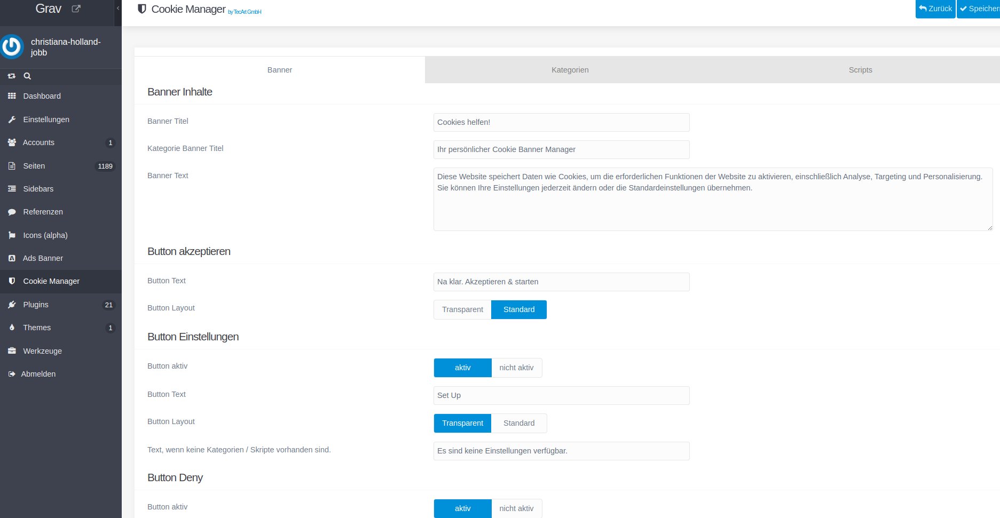
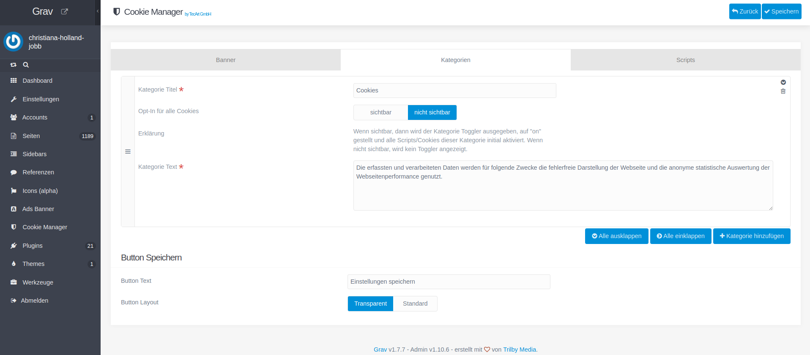
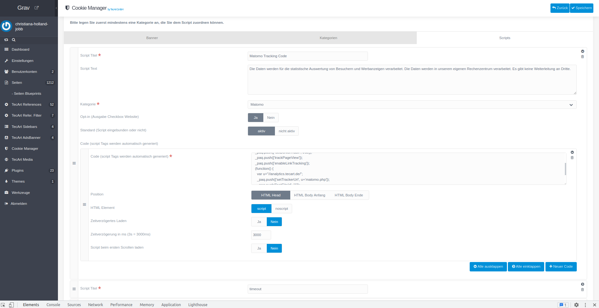

[](https://www.tecart.de)

# TecArt Cookie Manager Plugin

The **Tecart Cookie Manager** Plugin is an admin panel extension for [Grav CMS](http://github.com/getgrav/grav).
Cookie Banner is based on the popular **[Cookie Consent JavaScript API](https://www.osano.com/cookieconsent/documentation/javascript-api/)**.

Using of the Cookie Consent JavaScript API Osano by extending with an own cookie banner script tecart-cookie-manager.js
https://www.osano.com/cookieconsent/documentation/javascript-api/

The Plugin requires the use of the Grav the admin plugin.

**Features**
- Admin Cookie Manager to create scripts, categories and change the banner content and buttons
- Cookie Banner to enable or disable cookies via opt-in
- until settings or allow a clicked button only scripts and cookies are includes that are set to status activated in admin banner manager
- status and basic initialisation are used from Cookie Consent JavaScript API Osano
- button allow = status allow - allow all script from admin banner manager
- button deny = status: deny - allow necessary scripts (scripts set to standard: active in admin banner manager)
- button settings = status: dismiss - allow scripts set in website cookie settings by user opt-in (checkbox)
- html code only active scripts are includes. On deny or opt-out they will be removed
- cookie banner is revocable
- admin setting opt-in: yes/no means, if opt-in toggle is available for users on website cookie banner
- admin setting default active/not active means, if script is included in website
- there is an option to set the script position (body-top, body-bottom, head-bottom)
- you can override styles in your own css

**Note**
when creating code items, script tags are automatically wrapped in "script" or "noscript" tags for each element in output function.

## Screenshot

**Admin Panel**





**Frontend**

Cookie banner and settings modal


## Installation

Installing the **Tecart Cookie Manager** plugin can be done in one of three ways: The GPM (Grav Package Manager) installation method lets you quickly install the plugin with a simple terminal command, the manual method lets you do so via a zip file, and the admin method lets you do so via the Admin Plugin.

### GPM Installation (Preferred)

To install the plugin via the [GPM](http://learn.getgrav.org/advanced/grav-gpm), through your system's terminal (also called the command line), navigate to the root of your Grav-installation, and enter:

    bin/gpm install tecart-cookie-manager

This will install the Tecart Cookie Manager plugin into your `/user/plugins`-directory within Grav.
Its files can be found under `/your/site/grav/user/plugins/tecart-cookie-manager`.

Its data files are saved under
`/your/site/grav/user/data/cookie-manager`,
`/your/site/grav/user/data/cookie-manager-categories` and
`/your/site/grav/user/data/cookie-manager-scripts`.

In Plugin Settings you can change the storage folder to pages/assets.

`/your/site/grav/pages/assets/cookie-manager`,
`/your/site/grav/pages/assets/cookie-manager-categories` and
`/your/site/grav/pages/assets/cookie-manager-scripts`.

### Manual Installation

To install the plugin manually, download the zip-version of this repository and unzip it under `/your/site/grav/user/plugins`. Then rename the folder to `tecart-cookie-manager`.

You should now have all the plugin files under

    /your/site/grav/user/plugins/tecart-cookie-manager

### Admin Plugin

If you use the Admin Plugin, you can install the plugin directly by browsing the `Plugins`-menu and clicking on the `Add` button.

## Configuration

```yaml
enabled: true
data_storage: pages
```

Note that if you use the Admin Plugin, a file with your configuration named tecart-cookie-manager.yaml will be saved in the `user/config/plugins/`-folder once the configuration is saved in the Admin.

## Add Link to Settings in Theme

An example is a link on the website to open the cookie banner window with the settings.

```JavaScript
// open tecart cookie banner settings modal by click on link
$('.tcb-settings-link').on('click', function (e) {
    e.preventDefault();
    if($('.tcb-settings-modal').length > 0) {
        if ($('.tcb-settings-modal').css('display') == 'none') {
            $('.tcb-settings-modal').show();
        }
    }
});
```
HTML (link):

```twig

<li class="list-inline-item u-list__item">
    <a href="#" class="u-list__link text-secondary tcb-settings-link">Cookie Banner</a>
</li>

```

With Twig, the config variables can also be used in the theme.

```twig
config.plugins ["tecart-cookie-manager"]
```

Colors and texts can therefore also be built into the theme dynamically.

```twig
array [
    "enabled" =&gt; true
    "data_storage" =&gt; "pages"
    "custom_settings_link_text" =&gt; "Cookie Banner Einstellungen"
    "custom_settings_link_color" =&gt; "#7faf34"
    "custom_settings_link_text_color" =&gt; "#ffffff"
]
```

Example:

```twig

    
    
    <button type="button" class="btn btn-icon mb-2 tcb-settings-link"
    title="{{ config.plugins["tecart-cookie-manager"].custom_settings_link_text }}"
    style="color: {{ textColor }}; background-color: {{ bgColor }}; border-color: {{ bgColor }};">
         <i class="fas fa-cookie-bite"></i>
    </button>

```

## Credits

The Cookie Script is The plugin is based on the popular **[Cookie Consent JavaScript API](https://www.osano.com/cookieconsent/documentation/javascript-api/)**.

MIT License
Copyright (c) 2019 Osano, Inc., A Public Benefit Corporation
